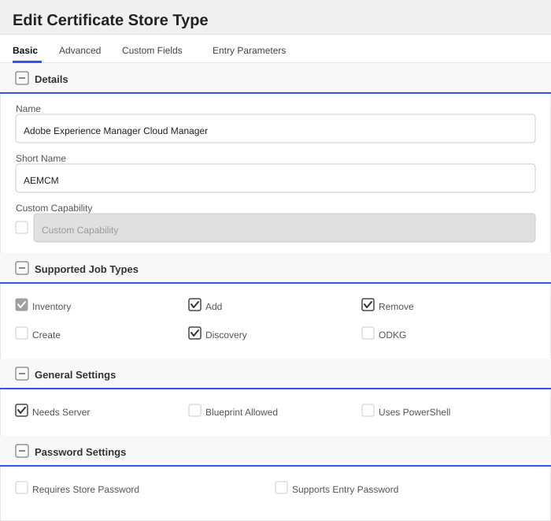
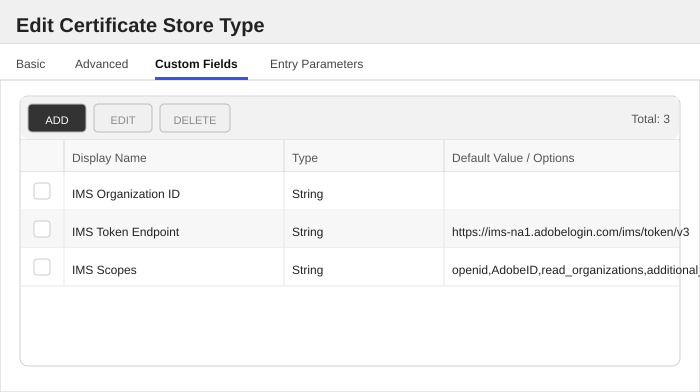
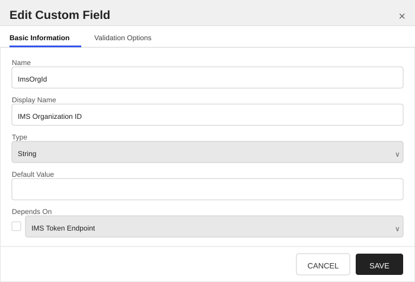
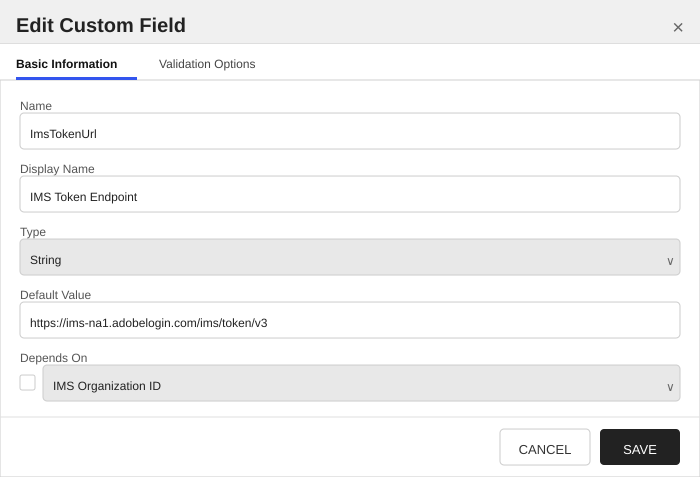
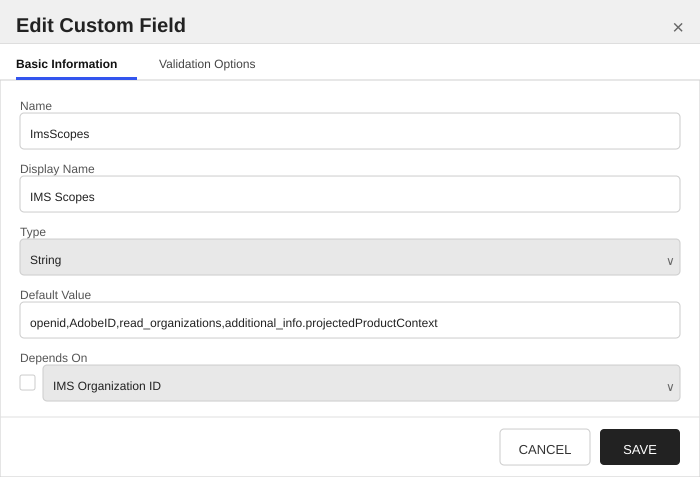

<h1 align="center" style="border-bottom: none">
    Adobe Experience Manager (Cloud Manager) Universal Orchestrator Extension
</h1>

<p align="center">
  <!-- Badges -->

<a href="https://github.com/Keyfactor/adobe-experience-manager-orchestrator/releases"></a>


</p>

<p align="center">
  <!-- TOC -->
  <a href="#support">
    <b>Support</b>
  </a>
  ·
  <a href="#installation">
    <b>Installation</b>
  </a>
  ·
  <a href="#license">
    <b>License</b>
  </a>
  ·
  <a href="https://github.com/orgs/Keyfactor/repositories?q=orchestrator">
    <b>Related Integrations</b>
  </a>
</p>

## Overview

The Adobe Experience Manager (Cloud Manager) Universal Orchestrator extension enables Keyfactor Command to
remotely manage customer-managed (OV/EV) TLS/SSL certificates on **Adobe Experience Manager as a Cloud Service**
(AEMaaCS) through the **Adobe Cloud Manager API**. These certificates secure custom domains served by AEMaaCS.
The extension supports inventory, enrollment (add), removal, and discovery.

In Cloud Manager, certificates are scoped to a **program**, so a certificate store of the `AEMCM` store type
represents a single Cloud Manager program (the store's Store Path is the numeric `programId`), and every
certificate in that program is managed through that one store.

Two platform caveats are worth calling out up front: Cloud Manager enforces a hard limit of **70 installed
certificates per program** (including Adobe-managed DV certificates and expired certificates) and up to
**100 SANs per certificate**; and Adobe-managed (DV) certificates are **read-only** to this extension, which
manages only customer-managed (OV/EV) certificates. Because of the 70-certificate limit, the extension prefers
updating an existing certificate over creating a new one.

## Compatibility

This integration is compatible with Keyfactor Universal Orchestrator version 10.4 and later.

## Support

The Adobe Experience Manager (Cloud Manager) Universal Orchestrator extension is supported by Keyfactor. If you require support for any issues or have feature request, please open a support ticket by either contacting your Keyfactor representative or via the Keyfactor Support Portal at https://support.keyfactor.com.

> If you want to contribute bug fixes or additional enhancements, use the **[Pull requests](../../pulls)** tab.

## Requirements & Prerequisites

Before installing the Adobe Experience Manager (Cloud Manager) Universal Orchestrator extension, we recommend that you install [kfutil](https://github.com/Keyfactor/kfutil). Kfutil is a command-line tool that simplifies the process of creating store types, installing extensions, and instantiating certificate stores in Keyfactor Command.

### Configure Adobe Cloud Manager API access

The extension authenticates to the Cloud Manager API with an Adobe IMS **OAuth Server-to-Server** credential
(Adobe has deprecated JWT authentication; it is not used).

1. In the [Adobe Developer Console](https://developer.adobe.com/console), create (or open) a project and add the
   **Cloud Manager API**, choosing the **OAuth Server-to-Server** credential type.
2. Assign the credential a product profile / role with permission to manage Cloud Manager SSL certificates — the
   **Business Owner** or **Deployment Manager** role.
3. Record the **Client ID**, **Client Secret**, and **IMS Organization ID**; these are entered on the certificate
   store (or discovery job) in Keyfactor Command.

> :warning: A credential without the **Business Owner** or **Deployment Manager** role can authenticate but cannot
> add, update, or delete certificates.

### Endpoint access / firewall

The orchestrator host needs outbound access to:

- The Keyfactor Command instance
- `ims-na1.adobelogin.com` — Adobe IMS token endpoint (to obtain the bearer access token)
- `cloudmanager.adobe.io` — the Cloud Manager API (inventory, add, remove, and discovery operations)

### Certificate requirements

Customer-managed certificates must meet Cloud Manager's requirements. The extension performs best-effort
client-side validation and Cloud Manager enforces the rest server-side:

- **OV or EV** certificates from a trusted CA. DV and self-signed certificates are not supported for
  customer-managed upload.
- Private key in **PKCS#8**, unencrypted. Supported key types: **RSA-2048**, or Elliptic Curve
  **secp256r1 (prime256v1)** / **secp384r1**. RSA-3072/4096 are not supported by Cloud Manager.
- Up to **100 SANs** per certificate.

The extension automatically splits the PKCS#12 supplied by Command into the leaf certificate, the unencrypted
PKCS#8 private key, and the intermediate chain **with the leaf excluded** (Cloud Manager rejects uploads that
include the leaf in the chain).

## AEMCM Certificate Store Type

To use the Adobe Experience Manager (Cloud Manager) Universal Orchestrator extension, you **must** create the AEMCM Certificate Store Type. This only needs to happen _once_ per Keyfactor Command instance.

The `AEMCM` certificate store type represents a single **Adobe Cloud Manager program**. When you define a
certificate store of this type, its Store Path is the numeric `programId`, and the store manages every
customer-managed (OV/EV) SSL certificate in that program through the Cloud Manager API.

The certificate **alias is the Adobe certificate name**. It is supplied at enrollment, stored as the certificate's
name in Cloud Manager, and reported back by inventory, so aliases round-trip between enrollment and inventory. Name
uniqueness within a program is enforced on enrollment.

Caveats specific to this store type:

- A program is limited to **70 installed certificates** (including Adobe-managed DV and expired certificates) and
  each certificate to **100 SANs**. To conserve this budget the extension updates an existing certificate when it
  can, rather than creating duplicates.
- Adobe-managed (DV) certificates are **read-only**; the extension will not modify or remove them.

#### Adobe Experience Manager Cloud Manager Requirements

Before creating certificate stores of this type:

1. Configure an Adobe IMS **OAuth Server-to-Server** credential with the **Business Owner** or **Deployment
   Manager** role, as described in the extension-wide Requirements section.
2. Record the credential's **Client ID**, **Client Secret**, and **IMS Organization ID**.
3. Identify the Cloud Manager **`programId`** for each program you intend to manage (a Discovery job can find these
   for you).

Credentials map to the store fields as follows: **Server Username** = IMS Client ID, **Server Password** = IMS
Client Secret, and the **IMS Organization ID** custom field = your IMS Org ID.

#### Supported Operations

| Operation    | Is Supported |
|--------------|--------------|
| Add          | ✅ Checked |
| Remove       | ✅ Checked |
| Discovery    | ✅ Checked |
| Reenrollment | 🔲 Unchecked |
| Create       | 🔲 Unchecked |

#### Store Type Creation

##### Using kfutil:
`kfutil` is a custom CLI for the Keyfactor Command API and can be used to create certificate store types.
For more information on [kfutil](https://github.com/Keyfactor/kfutil) check out the [docs](https://github.com/Keyfactor/kfutil?tab=readme-ov-file#quickstart)

   <details><summary>Click to expand AEMCM kfutil details</summary>

   ##### Using online definition from GitHub:
   This will reach out to GitHub and pull the latest store-type definition
   ```shell
   # Adobe Experience Manager Cloud Manager
   kfutil store-types create AEMCM
   ```

   ##### Offline creation using integration-manifest file:
   If required, it is possible to create store types from the [integration-manifest.json](./integration-manifest.json) included in this repo.
   You would first download the [integration-manifest.json](./integration-manifest.json) and then run the following command
   in your offline environment.
   ```shell
   kfutil store-types create --from-file integration-manifest.json
   ```
   </details>

#### Manual Creation
Below are instructions on how to create the AEMCM store type manually in
the Keyfactor Command Portal

   <details><summary>Click to expand manual AEMCM details</summary>

   Create a store type called `AEMCM` with the attributes in the tables below:

   ##### Basic Tab
   | Attribute | Value | Description |
   | --------- | ----- | ----- |
   | Name | Adobe Experience Manager Cloud Manager | Display name for the store type (may be customized) |
   | Short Name | AEMCM | Short display name for the store type |
   | Capability | AEMCM | Store type name orchestrator will register with. Check the box to allow entry of value |
   | Supports Add | ✅ Checked | Indicates that the Store Type supports Management Add |
   | Supports Remove | ✅ Checked | Indicates that the Store Type supports Management Remove |
   | Supports Discovery | ✅ Checked | Indicates that the Store Type supports Discovery |
   | Supports Reenrollment | 🔲 Unchecked | Indicates that the Store Type supports Reenrollment |
   | Supports Create | 🔲 Unchecked | Indicates that the Store Type supports store creation |
   | Needs Server | ✅ Checked | Determines if a target server name is required when creating store |
   | Blueprint Allowed | 🔲 Unchecked | Determines if store type may be included in an Orchestrator blueprint |
   | Uses PowerShell | 🔲 Unchecked | Determines if underlying implementation is PowerShell |
   | Requires Store Password | 🔲 Unchecked | Enables users to optionally specify a store password when defining a Certificate Store. |
   | Supports Entry Password | 🔲 Unchecked | Determines if an individual entry within a store can have a password. |

   The Basic tab should look like this:

   

   ##### Advanced Tab
   | Attribute | Value | Description |
   | --------- | ----- | ----- |
   | Supports Custom Alias | Required | Determines if an individual entry within a store can have a custom Alias. |
   | Private Key Handling | Required | This determines if Keyfactor can send the private key associated with a certificate to the store. |
   | PFX Password Style | Default | 'Default' - PFX password is randomly generated, 'Custom' - PFX password may be specified when the enrollment job is created (Requires the Allow Custom Password application setting to be enabled.) |

   The Advanced tab should look like this:

   

   > For Keyfactor **Command versions 24.4 and later**, a Certificate Format dropdown is available with PFX and PEM options. Ensure that **PFX** is selected, as this determines the format of new and renewed certificates sent to the Orchestrator during a Management job. Currently, all Keyfactor-supported Orchestrator extensions support only PFX.

   ##### Custom Fields Tab
   Custom fields operate at the certificate store level and are used to control how the orchestrator connects to the remote target server containing the certificate store to be managed. The following custom fields should be added to the store type:

   | Name | Display Name | Description | Type | Default Value/Options | Required |
   | ---- | ------------ | ---- | --------------------- | -------- | ----------- |
   | ImsOrgId | IMS Organization ID | The Adobe IMS Organization ID (e.g. 'XXXXXXXX@AdobeOrg'), sent as the 'x-gw-ims-org-id' header on Cloud Manager API requests. This is an identifier, not a credential. | String |  | ✅ Checked |
   | ImsTokenUrl | IMS Token Endpoint | The Adobe IMS OAuth Server-to-Server token endpoint used to obtain access tokens. | String | https://ims-na1.adobelogin.com/ims/token/v3 | ✅ Checked |
   | ImsScopes | IMS Scopes | Comma-separated IMS scopes requested for the access token. | String | openid,AdobeID,read_organizations,additional_info.projectedProductContext | ✅ Checked |

   The Custom Fields tab should look like this:

   

   ###### IMS Organization ID
   The Adobe IMS Organization ID (e.g. 'XXXXXXXX@AdobeOrg'), sent as the 'x-gw-ims-org-id' header on Cloud Manager API requests. This is an identifier, not a credential.

   
   


   ###### IMS Token Endpoint
   The Adobe IMS OAuth Server-to-Server token endpoint used to obtain access tokens.

   
   


   ###### IMS Scopes
   Comma-separated IMS scopes requested for the access token.

   
   


   </details>

## Installation

1. **Download the latest Adobe Experience Manager (Cloud Manager) Universal Orchestrator extension from GitHub.**

    Navigate to the [Adobe Experience Manager (Cloud Manager) Universal Orchestrator extension GitHub version page](https://github.com/Keyfactor/adobe-experience-manager-orchestrator/releases/latest). Refer to the compatibility matrix below to determine which asset should be downloaded. Then, click the corresponding asset to download the zip archive.

   | Universal Orchestrator Version | Latest .NET version installed on the Universal Orchestrator server | `rollForward` condition in `Orchestrator.runtimeconfig.json` | `adobe-experience-manager-orchestrator` .NET version to download |
   | --------- | ----------- | ----------- | ----------- |
   | Older than `11.0.0` | | | `net6.0` |
   | Between `11.0.0` and `11.5.1` (inclusive) | `net6.0` | | `net6.0` |
   | Between `11.0.0` and `11.5.1` (inclusive) | `net8.0` | `Disable` | `net6.0` |
   | Between `11.0.0` and `11.5.1` (inclusive) | `net8.0` | `LatestMajor` | `net8.0` |
   | `11.6` _and_ newer | `net8.0` | | `net8.0` |
   | `25.5` _and_ newer | `net10.0` | | `net10.0` |

    Unzip the archive containing extension assemblies to a known location.

    > **Note** If you don't see an asset with a corresponding .NET version, you should always assume that it was compiled for `net10.0`.

2. **Locate the Universal Orchestrator extensions directory.**

    * **Default on Windows** - `C:\Program Files\Keyfactor\Keyfactor Orchestrator\extensions`
    * **Default on Linux** - `/opt/keyfactor/orchestrator/extensions`

3. **Create a new directory for the Adobe Experience Manager (Cloud Manager) Universal Orchestrator extension inside the extensions directory.**

    Create a new directory called `adobe-experience-manager-orchestrator`.
    > The directory name does not need to match any names used elsewhere; it just has to be unique within the extensions directory.

4. **Copy the contents of the downloaded and unzipped assemblies from __step 2__ to the `adobe-experience-manager-orchestrator` directory.**

5. **Restart the Universal Orchestrator service.**

    Refer to [Starting/Restarting the Universal Orchestrator service](https://software.keyfactor.com/Core-OnPrem/Current/Content/InstallingAgents/NetCoreOrchestrator/StarttheService.htm).

6. **(optional) PAM Integration**

    The Adobe Experience Manager (Cloud Manager) Universal Orchestrator extension is compatible with all supported Keyfactor PAM extensions to resolve PAM-eligible secrets. PAM extensions running on Universal Orchestrators enable secure retrieval of secrets from a connected PAM provider.

    To configure a PAM provider, [reference the Keyfactor Integration Catalog](https://keyfactor.github.io/integrations-catalog/content/pam) to select an extension and follow the associated instructions to install it on the Universal Orchestrator (remote).

> The above installation steps can be supplemented by the [official Command documentation](https://software.keyfactor.com/Core-OnPrem/Current/Content/InstallingAgents/NetCoreOrchestrator/CustomExtensions.htm?Highlight=extensions).

## Post Installation

After installing the extension DLLs on the orchestrator, create the `AEMCM` certificate store type in Keyfactor
Command — with [kfutil](https://github.com/Keyfactor/kfutil) (`kfutil store-types create AEMCM`) or manually from
`integration-manifest.json` — before defining any certificate stores.

## Defining Certificate Stores

### Store Creation

#### Manually with the Command UI

<details><summary>Click to expand details</summary>

1. **Navigate to the _Certificate Stores_ page in Keyfactor Command.**

    Log into Keyfactor Command, toggle the _Locations_ dropdown, and click _Certificate Stores_.

2. **Add a Certificate Store.**

    Click the Add button to add a new Certificate Store. Use the table below to populate the **Attributes** in the **Add** form.

   | Attribute | Description |
   | --------- | ----------- |
   | Category | Select "Adobe Experience Manager Cloud Manager" or the customized certificate store name from the previous step. |
   | Container | Optional container to associate certificate store with. |
   | Client Machine | The Adobe Cloud Manager API base URL. Enter 'https://cloudmanager.adobe.io'. |
   | Store Path | The numeric Cloud Manager program identifier (programId) that this store manages; for example, '12345'. One store maps to one program. |
   | Orchestrator | Select an approved orchestrator capable of managing `AEMCM` certificates. Specifically, one with the `AEMCM` capability. |
   | ImsOrgId | The Adobe IMS Organization ID (e.g. 'XXXXXXXX@AdobeOrg'), sent as the 'x-gw-ims-org-id' header on Cloud Manager API requests. This is an identifier, not a credential. |
   | ImsTokenUrl | The Adobe IMS OAuth Server-to-Server token endpoint used to obtain access tokens. |
   | ImsScopes | Comma-separated IMS scopes requested for the access token. |

</details>

#### Using kfutil CLI

<details><summary>Click to expand details</summary>

1. **Generate a CSV template for the AEMCM certificate store**

    ```shell
    kfutil stores import generate-template --store-type-name AEMCM --outpath AEMCM.csv
    ```
2. **Populate the generated CSV file**

    Open the CSV file, and reference the table below to populate parameters for each **Attribute**.

   | Attribute | Description |
   | --------- | ----------- |
   | Category | Select "Adobe Experience Manager Cloud Manager" or the customized certificate store name from the previous step. |
   | Container | Optional container to associate certificate store with. |
   | Client Machine | The Adobe Cloud Manager API base URL. Enter 'https://cloudmanager.adobe.io'. |
   | Store Path | The numeric Cloud Manager program identifier (programId) that this store manages; for example, '12345'. One store maps to one program. |
   | Orchestrator | Select an approved orchestrator capable of managing `AEMCM` certificates. Specifically, one with the `AEMCM` capability. |
   | Properties.ImsOrgId | The Adobe IMS Organization ID (e.g. 'XXXXXXXX@AdobeOrg'), sent as the 'x-gw-ims-org-id' header on Cloud Manager API requests. This is an identifier, not a credential. |
   | Properties.ImsTokenUrl | The Adobe IMS OAuth Server-to-Server token endpoint used to obtain access tokens. |
   | Properties.ImsScopes | Comma-separated IMS scopes requested for the access token. |

3. **Import the CSV file to create the certificate stores**

    ```shell
    kfutil stores import csv --store-type-name AEMCM --file AEMCM.csv
    ```

</details>

#### PAM Provider Eligible Fields
<details><summary>Attributes eligible for retrieval by a PAM Provider on the Universal Orchestrator</summary>

If a PAM provider was installed _on the Universal Orchestrator_ in the [Installation](#Installation) section, the following parameters can be configured for retrieval _on the Universal Orchestrator_.

   | Attribute | Description |
   | --------- | ----------- |
   | ServerUsername | Username to use when connecting to server |
   | ServerPassword | Password to use when connecting to server |

Please refer to the **Universal Orchestrator (remote)** usage section ([PAM providers on the Keyfactor Integration Catalog](https://keyfactor.github.io/integrations-catalog/content/pam)) for your selected PAM provider for instructions on how to load attributes orchestrator-side.
> Any secret can be rendered by a PAM provider _installed on the Keyfactor Command server_. The above parameters are specific to attributes that can be fetched by an installed PAM provider running on the Universal Orchestrator server itself.

</details>

> The content in this section can be supplemented by the [official Command documentation](https://software.keyfactor.com/Core-OnPrem/Current/Content/ReferenceGuide/Certificate%20Stores.htm?Highlight=certificate%20store).

### Certificate Operations

#### Inventory

Inventory pages through all certificates in the program and reports every one — including Adobe-managed (DV) and
expired certificates — so the 70-certificate limit is visible. Certificate type, status, common name, SANs, and
expiration are surfaced as entry parameters. DV certificates are reported read-only.

#### Add / Enrollment

Provide an alias; it becomes the Adobe certificate name. Enrolling a name that already exists in the program
**fails unless _Overwrite_ is enabled**, in which case the matching certificate is updated in place. To conserve
the 70-certificate budget, an incoming certificate that matches an existing one by alias or by an identical SAN set
updates that certificate rather than creating a duplicate. If the program is at the 70-certificate limit and no
existing certificate matches, the job fails with guidance to remove expired or unused certificates. Key type
(RSA-2048 or EC secp256r1/secp384r1) and the 100-SAN limit are validated before upload.

#### Remove

Removing a certificate deletes it from the program. If the certificate is still referenced by one or more domain
mappings, the job fails and lists the offending mapping(s) — remove the mapping(s) first, then retry, and run the
pipeline afterward to fully undeploy. Adobe-managed (DV) certificates cannot be removed.

### Domain Mappings and Certificate Bindings

In Cloud Manager, a certificate only serves live traffic once a **domain mapping** (CDN configuration)
associates a domain with it. This extension manages **certificates only** — it does not create, update, or
delete domain mappings. Bindings are managed in Cloud Manager (or through the Cloud Manager domain-mapping APIs)
outside of Keyfactor. This has several implications worth understanding:

- **Enrollment installs a certificate; it does not bind it.** Adding a certificate uploads it to the program and
  makes it available, but does not attach it to any domain. Until a domain mapping pointing at the certificate is
  created in Cloud Manager, the certificate is installed but not serving traffic.

- **Renew with _Overwrite_ to preserve existing bindings.** Renewing or replacing a certificate with _Overwrite_
  enabled updates it **in place** — the Cloud Manager certificate id does not change — so any existing domain
  mappings continue to point at the renewed certificate automatically, with no re-mapping required. This is the
  recommended renewal workflow.

- **A brand-new certificate is not automatically adopted by existing domains.** If you enroll a *new* certificate
  (a new alias / name) instead of overwriting, existing domain mappings continue to reference the previous
  certificate. Re-point the mapping(s) to the new certificate in Cloud Manager before retiring the old one.
  (Cloud Manager's own behavior is that when multiple SAN certificates cover the same domain, the most recently
  updated/deployed certificate is served for that domain.)

- **A bound certificate cannot be removed.** A Remove job fails if the target certificate is still referenced by
  one or more domain mappings; the failure message lists the mapping(s). Remove or re-point those mappings in
  Cloud Manager, then re-run the Remove job. Certificates with no domain mappings delete cleanly (run the pipeline
  afterward to fully undeploy).

> Managing certificate-to-domain bindings from Keyfactor is intentionally out of scope for this release. The Cloud
> Manager domain-mapping APIs support full create/update/delete, so this could be added later (for example, via
> entry parameters) if it becomes a requirement.

### Certificate Enrollment Alias Requirements

The alias is the Adobe certificate name and must be unique within the program. Use **Overwrite** to renew or
replace an existing certificate (matched by that name). Certificates created outside Keyfactor that happen to share
a name are surfaced during inventory as `name (id)` so aliases remain unique.

## Discovering Certificate Stores with the Discovery Job

### Adobe Experience Manager Cloud Manager Discovery Job

Discovery enumerates the Cloud Manager programs your credential can access and returns each as a discoverable
store path (a `programId`).

Because a Discovery job has no certificate store, the store's custom fields (including the IMS Org ID) are not
available on the discovery form. Provide the Org ID(s) through the standard discovery fields instead:

- **Client Machine**: the Cloud Manager base URL, `https://cloudmanager.adobe.io`.
- **Server Username / Password**: the IMS Client ID / Client Secret.
- **Directories to Search**: one or more **comma-separated IMS Organization IDs**. This field is required — with no
  value the job cannot determine which organization's tenants and programs to enumerate.

For each Org ID, the job lists the organization's tenants (`GET /api/tenants`) and then each tenant's programs
(`GET /api/tenant/{tenantId}/programs`), returning every `programId`. Approve a result to create an `AEMCM`
certificate store for that program.


## License

Apache License 2.0, see [LICENSE](LICENSE).

## Related Integrations

See all [Keyfactor Universal Orchestrator extensions](https://github.com/orgs/Keyfactor/repositories?q=orchestrator).
